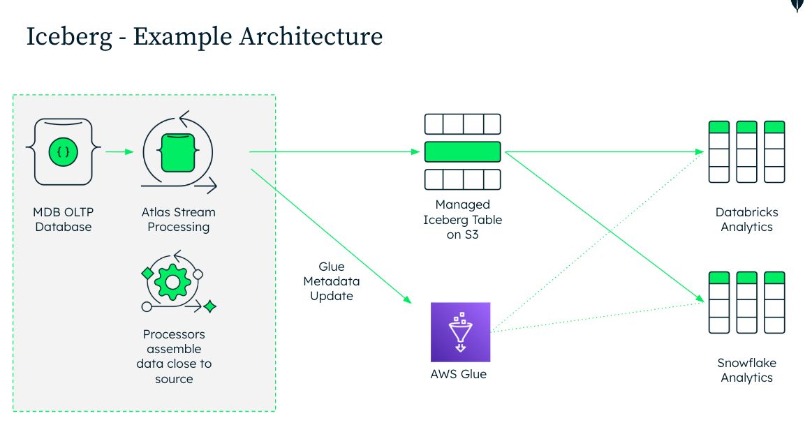

# MongoDB Atlas `$iceberg` Demo

A small end-to-end demo showing operational MongoDB Atlas data continuously mirrored into an Apache Iceberg v2 table in Amazon S3 with Atlas Stream Processing.

> **MongoDB operational data → Atlas Stream Processing → Iceberg on S3 → AWS Glue → Athena**

The demo deliberately focuses on four operations:

```text
INSERT → UPDATE → DELETE → SCHEMA CHANGE
```

If those four changes are visible end-to-end, the architecture speaks for itself.

## Architecture



The source Atlas cluster can be on AWS, Azure, or GCP. The current `$iceberg` sink writes to Amazon S3; when the source/workspace is cross-cloud, account for network latency and egress.

## Repository

```text
mongodb-iceberg-demo/
├── README.md
├── config.py
├── requirements.txt
├── Makefile
├── scripts/
│   ├── common.py
│   ├── seed_orders.py
│   ├── insert_order.py
│   ├── update_order.py
│   ├── delete_order.py
│   ├── add_schema_field.py
│   ├── reset_demo.py
│   └── live_demo.py
├── setup/
│   ├── aws/
│   │   ├── README.md
│   │   └── bootstrap.sh
│   └── atlas/
│       └── README.md
├── stream-processing/
│   ├── create_processor.js
│   ├── status.js
│   ├── stop_processor.js
│   └── drop_processor.js
├── sql/
│   ├── 01_orders_by_region.sql
│   ├── 02_find_live_order.sql
│   ├── 03_validate_update.sql
│   ├── 04_validate_delete.sql
│   └── 05_validate_schema.sql
└── docs/
    ├── architecture.png
    └── DEMO_FLOW.md
```

## 1. Local Setup

Python 3.10+ is recommended.

```bash
python3 -m venv .venv
source .venv/bin/activate
pip install -r requirements.txt
```

Edit `config.py` and set the Atlas connection string.

```python
MONGODB_URI = "mongodb+srv://<username>:<password>@<cluster>/"
DATABASE_NAME = "iceberg_demo"
COLLECTION_NAME = "orders"
```

For a public repository, do not commit real credentials.

## 2. Create the AWS Side

The helper script creates:

- an S3 bucket
- public-access blocking on the bucket
- an AWS Glue database named `mongodb_iceberg_demo`

```bash
cd setup/aws
./bootstrap.sh
```

Optional overrides:

```bash
AWS_REGION=us-east-1 \
S3_BUCKET=my-mongodb-iceberg-demo \
GLUE_DATABASE=mongodb_iceberg_demo \
./bootstrap.sh
```

The script prints the exact bucket, region, and Glue database values to copy into `stream-processing/create_processor.js`.

See `setup/aws/README.md` for the Atlas Unified AWS Access step.

## 3. Create Atlas Resources

Create or reuse:

1. An Atlas cluster.
2. An Atlas Stream Processing workspace.
3. An Atlas source connection named `atlas-orders` pointing at the cluster.
4. An AWS S3 connection named `s3-iceberg` using Unified AWS Access.

For `$iceberg`, use an **SP10, SP30, or SP50** processor tier.

Detailed setup notes are in `setup/atlas/README.md`.

## 4. Seed the `orders` Collection

```bash
python scripts/seed_orders.py
```

This creates/replaces a small deterministic set of demo orders using IDs prefixed with `DEMO-`.

## 5. Configure the Stream Processor

Edit the constants at the top of:

```text
stream-processing/create_processor.js
```

At minimum, verify:

```javascript
const SOURCE_CONNECTION = "atlas-orders";
const S3_CONNECTION = "s3-iceberg";
const S3_BUCKET = "mongodb-iceberg-demo-REPLACE_ME";
const AWS_REGION = "us-east-1";
const ICEBERG_DATABASE = "mongodb_iceberg_demo";
```

The pipeline uses:

- `$source` with `initialSync`
- CDC change stream events
- `$replaceRoot` to emit `fullDocument` for inserts/updates/replaces and `documentKey` for deletes
- `$iceberg` in `cdc` mode
- AWS Glue as the Iceberg catalog

The important pipeline is:

```javascript
const isDeleteExpr = {
  $eq: [{ $meta: "stream.source.operationType" }, "delete"]
};

const pipeline = [
  {
    $source: {
      connectionName: SOURCE_CONNECTION,
      db: SOURCE_DATABASE,
      coll: SOURCE_COLLECTION,
      initialSync: { enable: true },
      config: { fullDocument: "required" }
    }
  },
  {
    $match: {
      operationType: { $in: ["insert", "update", "delete", "replace"] }
    }
  },
  {
    $replaceRoot: {
      newRoot: {
        $cond: {
          if: isDeleteExpr,
          then: "$documentKey",
          else: "$fullDocument"
        }
      }
    }
  },
  {
    $iceberg: {
      connectionName: S3_CONNECTION,
      bucket: S3_BUCKET,
      databaseName: ICEBERG_DATABASE,
      tableName: ICEBERG_TABLE,
      path: ICEBERG_PATH,
      region: AWS_REGION,
      mode: "cdc",
      idFieldName: "_id",
      catalog: { type: "glue" }
    }
  }
];
```

Connect `mongosh` to the **Stream Processing workspace**, then run:

```javascript
load("stream-processing/create_processor.js")
```

The script creates `ordersToIceberg` and starts it on SP10.

## 6. Verify the Initial Sync in Athena

Once the first data has landed and Glue contains the table, run:

```sql
SELECT
    region,
    COUNT(*) AS orders,
    SUM(amount) AS revenue
FROM mongodb_iceberg_demo.orders
GROUP BY region
ORDER BY revenue DESC;
```

The same query is in `sql/01_orders_by_region.sql`.

## 7. Run the Live Demo

### Guided mode

```bash
python scripts/live_demo.py
```

The script pauses between each operation so you can refresh Athena after every change.

### Individual commands

Insert:

```bash
python scripts/insert_order.py
```

Update:

```bash
python scripts/update_order.py
```

Delete:

```bash
python scripts/delete_order.py
```

Schema evolution:

```bash
python scripts/add_schema_field.py
```

Reset the live demo documents:

```bash
python scripts/reset_demo.py
```

## 8. Demo Queries

After insert:

```sql
SELECT *
FROM mongodb_iceberg_demo.orders
WHERE _id = 'ORD-LIVE-001';
```

After update:

```sql
SELECT _id, status, amount
FROM mongodb_iceberg_demo.orders
WHERE _id = 'ORD-LIVE-001';
```

After delete, the same lookup should return zero rows.

After schema evolution:

```sql
SELECT _id, product, fraudScore
FROM mongodb_iceberg_demo.orders
WHERE _id = 'ORD-LIVE-002';
```

Depending on how Athena surfaces identifier casing, you may need to use the normalized column name it shows for `fraudScore`.

## 9. Stream Processor Management

From `mongosh` connected to the Stream Processing workspace:

```javascript
load("stream-processing/status.js")
load("stream-processing/stop_processor.js")
load("stream-processing/drop_processor.js")
```

## Demo Story

The entire demo should take only a few minutes:

1. Show an operational order in Atlas.
2. Show the same data aggregated in Athena.
3. Insert `ORD-LIVE-001` and query it in Athena.
4. Change `PROCESSING` → `SHIPPED` and `225` → `199`.
5. Delete it and show zero rows.
6. Insert `ORD-LIVE-002` with a brand-new `fraudScore` field.
7. Show the evolved Iceberg schema / new column.

The point is not raw throughput. The point is that an operational MongoDB collection can be maintained as an open Iceberg table without building a separate Kafka + connector + Spark ingestion chain.

## Current `$iceberg` Notes

As of August 2026:

- `$iceberg` writes Apache Iceberg tables to AWS S3.
- `$iceberg` must be the final pipeline stage.
- `cdc` and `insert` modes are supported.
- CDC mode uses stream operation metadata to apply inserts, updates, replacements, and deletes.
- Iceberg schema evolves as new fields are observed.
- Output is at-least-once.
- `$iceberg` is supported on SP10, SP30, and SP50.
- BSON objects and arrays are serialized as JSON strings; primitive fields map naturally to Iceberg primitive columns.

Official documentation:

- https://www.mongodb.com/docs/atlas/atlas-stream-processing/sp-agg-iceberg/
- https://www.mongodb.com/docs/atlas/atlas-stream-processing/manage-connection-registry/
- https://www.mongodb.com/docs/manual/reference/method/sp.createstreamprocessor/
